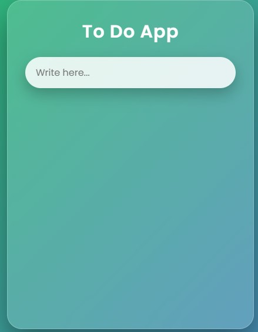
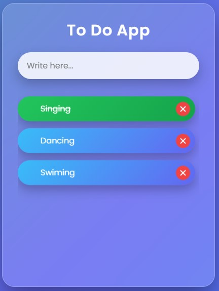

# To-Do App

A simple and responsive To-Do application built using HTML, CSS, and JavaScript that helps users manage daily tasks efficiently.

## 📸 Screenshots
## 📸 Home Page & Result Page

  
  

## ✨ Features
- Add, edit, and delete tasks  
- Mark tasks as completed  
- Responsive design for all devices  
- Clean and user-friendly interface  

## 🛠️ Technologies Used
- HTML5  
- CSS3  
- JavaScript  

## 📂 Project Structure
ToDo-App/
│── index.html
│── style.css
│── README.md